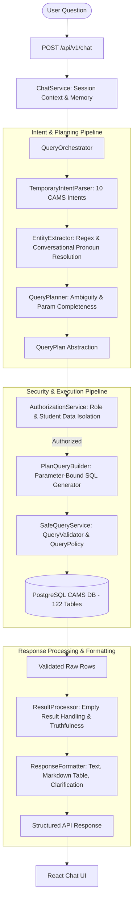
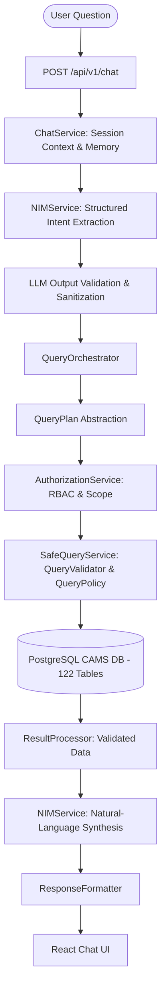
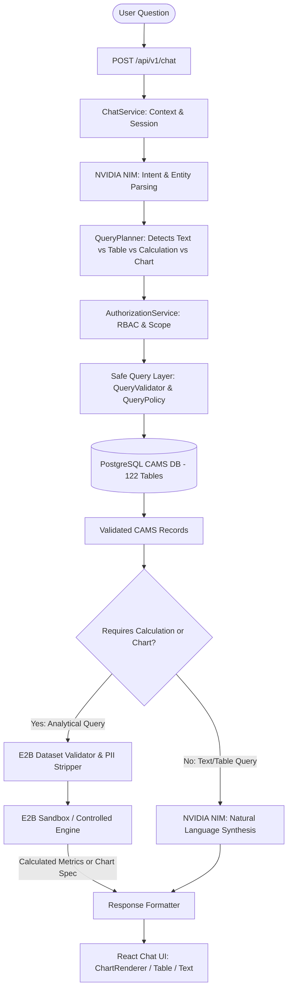

# CAMS AI Chatbot Architecture Document
## AI-Powered College Management Information System (Phase 2 Data-Access Foundation)

### 1. Architectural Overview & System Flow

The CAMS AI Chatbot enables natural language conversational intelligence over the PostgreSQL database without allowing raw SQL generation or exposing sensitive credentials.

The end-to-end request-response cycle is strictly structured as follows:

```mermaid
flowchart TD
    User([User: Student / Faculty / HOD / Admin]) -->|Natural Language Query| Frontend[React Frontend]
    Frontend -->|HTTPS API Request + JWT| Backend[FastAPI Backend /api/v1]
    Backend --> Auth[Authentication & RBAC Scoping]
    Auth --> Orchestrator[AI / Query Orchestrator]
    
    subgraph Controlled_Query_Pipeline [Controlled Query Intent Abstraction]
        Orchestrator --> LLM_Intent[NVIDIA NIM: Natural Language Intent Parsing]
        LLM_Intent --> IntentSchema[StructuredQueryIntent: JSON Domain & Entities]
        IntentSchema --> Builder[IntentQueryBuilder: Parameter-Bound Safe SQL Builder]
    end

    subgraph Safe_Query_Layer [Safe Query Layer (Security Core)]
        Builder --> Validator[QueryValidator: AST & Lexical Parsing]
        Validator --> Policy[QueryPolicy: Role Allowlist & Limit Enforcer]
        Policy --> Executor[QueryExecutor: Parameterized Execution + 10s Timeout]
    end

    Executor -->|Read-Only SQL| Postgres[(PostgreSQL CAMS DB - 122 Tables)]
    Postgres -->|Raw Result Rows| Sanitizer[QueryResultFormatter: PII & Password Stripper]
    Sanitizer --> Decision{Calculations / Chart Required?}
    Decision -->|Yes| E2B[E2B Sandbox: Code Execution & Charting - Phase 3]
    Decision -->|No| LLM_Response[NVIDIA NIM: Natural Language Synthesis - Phase 3]
    E2B --> LLM_Response
    LLM_Response --> Formatter[Response Formatter]
    Formatter -->|Structured JSON + Tabular Data| Frontend
    Frontend -->|Rendered Message & Tables| User
```

---

### 2. Controlled Query Abstraction: Why the LLM Does NOT Execute SQL Directly

A fundamental vulnerability of naive Text-to-SQL systems is allowing the LLM to generate arbitrary SQL strings sent directly to the database.

**In CAMS, the LLM will NEVER execute SQL directly:**
1. **Natural Language Understanding**: NVIDIA NIM interprets the user prompt into a strongly typed `StructuredQueryIntent`:
   ```json
   {
     "domain": "attendance",
     "intent": "recent_records",
     "entities": {
       "date": "2026-09-22"
     },
     "requested_output": "summary"
   }
   ```
2. **Intent-to-Query Mapping (`IntentQueryBuilder`)**:
   - Matches intent to pre-approved, audited query templates.
   - Automatically injects session identity parameters (`user_id = :current_user_id`).
   - Prevents student users from inquiring into other students' attendance or marks.
3. **Safe Query Layer Verification**:
   - Ensures query is strictly `SELECT`.
   - Disallows destructive keywords (`DROP`, `DELETE`, `UPDATE`, `INSERT`, `ALTER`, `TRUNCATE`, `GRANT`).
   - Enforces table allowlist and mandatory row limiting (`LIMIT 100`).
   - Executes with a session statement timeout (`statement_timeout = 10000ms`).

---

### 3. Safe Query Layer Components

#### A. `QueryPolicy`
Defines operational boundaries:
- `MAX_QUERY_ROW_LIMIT = 100` (Protects server memory).
- `STATEMENT_TIMEOUT_MS = 10000` (Prevents runaway CPU loops).
- `ALLOWED_CHATBOT_TABLES` vs `STRICTLY_FORBIDDEN_TABLES` (Blocks internal tables such as `audit_logs`, `system_settings`, `salary`).
- `ROLE_TABLE_PERMISSIONS`: Dynamic table authorization per `UserRole`.

#### B. `QueryValidator`
- Token and regex AST parser.
- Rejects multi-statements separated by semicolons (`;\s*\w+`).
- Rejects time-based blind injection (`pg_sleep`).
- Rejects SQL comments used for query truncation (`--`, `/* */`).
- Injects or clamps `LIMIT 100`.

#### C. `QueryExecutor`
- Executes queries against SQLAlchemy connection pool.
- Enforces transaction read-only mode (`SET LOCAL default_transaction_read_only = on`).
- Employs parameterized binding (`:param_name`).
- Masks raw database exceptions to avoid leaking table structures or credentials.

#### D. `QueryResultFormatter`
- Strips confidential fields (e.g. `hashed_password`, PII) before returning to services.
- Serializes Date, Time, Decimal, and UUID objects to standard JSON primitives.

---

### 4. Role-Based Access Control (RBAC) Scoping Model

| Role | Scope of Access | Enforced Constraints |
|---|---|---|
| **STUDENT** | Own profile, own attendance, own marks, enrolled courses, section timetable, own fee records | Parameter `user_id` bound to current student. Table access restricted. Sensitive PII stripped. |
| **FACULTY** | Assigned courses, allocated sections, own teaching schedule, student lists within assigned sections | Parameter `faculty_id` bound to current user. Cannot view institutional payroll or other faculty leaves without permission. |
| **HOD** | Department courses, department faculty workload, semester performance | Scoped to department degree programs. |
| **PRINCIPAL / ADMIN** | College-wide academic records, cross-department analytics, notice broadcasts | Full access to allowed academic tables. System settings remain protected. |

---

### 5. Dedicated Read-Only PostgreSQL User

The CAMS Chatbot backend connects using a least-privilege PostgreSQL user:

```sql
CREATE ROLE cams_readonly WITH LOGIN PASSWORD 'cams_readonly_pass';
GRANT CONNECT ON DATABASE cams_db TO cams_readonly;
GRANT USAGE ON SCHEMA public TO cams_readonly;
GRANT SELECT ON ALL TABLES IN SCHEMA public TO cams_readonly;
ALTER DEFAULT PRIVILEGES IN SCHEMA public GRANT SELECT ON TABLES TO cams_readonly;

-- Allow session logging in native CAMS tables
GRANT SELECT, INSERT, UPDATE, DELETE ON TABLE chat_sessions TO cams_readonly;
GRANT SELECT, INSERT, UPDATE, DELETE ON TABLE chat_messages TO cams_readonly;

ALTER ROLE cams_readonly SET default_transaction_read_only = 'on';
ALTER ROLE cams_readonly SET statement_timeout = '10000';
```
No database credentials or API keys are ever bundled into or accessible by the React frontend.

---

### 6. Phase 3: Core Chatbot Query Engine Architecture

Phase 3 establishes the end-to-end query engine transforming natural-language questions into controlled query intents and retrieving data safely through the Safe Query Layer.



#### A. Structured `QueryPlan` Abstraction
Natural language is NEVER converted directly into executable SQL. It is parsed into an intermediate `QueryPlan`:
```json
{
  "intent": "marks",
  "domain": "marks",
  "tables": ["internal_marks", "courses", "students", "users"],
  "filters": {
    "student_name": "student1",
    "roll_no": "LAW-001"
  },
  "fields": ["course_name", "internal_exam_mark", "assignment_mark", "total_mark"],
  "output_type": "table",
  "requires_clarification": false,
  "clarification_prompt": null,
  "target_entity": "LAW-001"
}
```

#### B. Supported CAMS Intents (Phase 3)
1. `student_information`: Student profiles, roll numbers, semesters, CGPA, degrees.
2. `attendance`: Attendance tracking, class hours, absence records.
3. `examination_schedule`: Upcoming CIA and semester exam schedules, centers, and dates.
4. `marks`: Internal assessments, test scores, assignments, viva, and totals.
5. `courses`: Course curriculum, credits, and semester course catalogs.
6. `timetable`: Weekly schedule, rooms, course codes, and lecture timings.
7. `faculty`: Faculty directory, designations, specializations, and departmental contacts.
8. `fees`: Fee records, due dates, fee structures, and payment statuses.
9. `notices`: Official campus bulletins, categories, priorities, and announcements.
10. `academic_calendar`: Term start/end dates, holidays, and college events.

#### C. Ambiguous Query Handling & Truthfulness
- **No Hallucination**: If the database returns 0 rows, the engine returns an honest empty-result message without hallucinating values.
- **Clarification Requests**: If an inquiry lacks required context (e.g., "Show my attendance" with no student identity), the engine prompts for the student ID or roll number instead of guessing.

#### D. Conversational Session Context
The session context retains student entities across turns. Follow-up pronouns ("his marks", "her attendance", "their timetable") resolve seamlessly to the previously mentioned student.

#### E. Strict Role-Based Scope Isolation
- **Students**: Allowed only to inspect their own records. Cross-student queries are blocked by `AuthorizationService` with `403 / Access Denied`.
- **Faculty**: Blocked from financial/fee records.
- **Admin**: System configuration and audit tables remain strictly forbidden under `QueryPolicy`.

---

### 7. Phase 4: NVIDIA NIM Natural Language Understanding & Synthesis

Phase 4 integrates NVIDIA NIM as the primary natural-language understanding (NLU) engine and response synthesizer:



#### A. Centralized System Prompts & Guardrails (`nim_prompts.py`)
- **Intent Extraction Prompt**: Enforces single valid JSON output, strictly forbids raw SQL generation, instructs model that CAMS PostgreSQL is the sole source of truth, and rejects prompt injection attempts.
- **Response Synthesis Prompt**: Enforces strict zero-hallucination rules. Explains and summarizes actual database rows. If zero rows exist, returns a verified empty-state response without inventing facts.

#### B. Output Validation & Sanitization (`_validate_and_sanitize_intent_json`)
- Strips markdown fences if generated.
- Validates intent against `SUPPORTED_INTENTS`.
- Restricts entities to allowlisted keys (`student_name`, `roll_no`, `student_id`, `semester`, `weekday`, `date`, `exam_type`, `section`).
- Validates data types (integers for semesters, ISO dates).
- Never executes invalid model responses.

#### C. Privacy & Security Protection
- **Zero Secret Exposure**: Credentials (`NVIDIA_API_KEY`, `DATABASE_URL`) exist solely in backend environment variables and are never sent to the LLM or frontend.
- **Minimum Data Sharing**: Only sanitized query results (max 10 rows) are sent to NVIDIA NIM for natural-language synthesis. Passwords, hashes, and sensitive personal information are stripped before transmission.
- **Prompt Injection Immunity**: Instructions to ignore system rules or drop tables are neutralized. Security decisions are handled exclusively by Python code and the Safe Query Layer.

---

### 8. Phase 5: E2B Sandbox Code Execution & Analytics Layer

Phase 5 integrates the **E2B Sandbox** as the controlled code-execution and data-analysis layer for inquiries that require mathematical computations, aggregations, trend analysis, or chart specifications.



#### A. Why E2B Sandbox is Used
1. **Air-Gapped Math & Analytics**: Eliminates math hallucination by the LLM (e.g. LLM miscalculating GPAs, attendance percentages, or class averages).
2. **Safe Code Execution**: Offloads dynamic aggregation, grouping, and statistical transforms to an isolated sandbox rather than evaluating code on the host web server.
3. **Structured Visualizations**: Formats raw database rows into verified, frontend-ready data points for interactive charts.

#### B. When E2B is Invoked
- **NEVER for text-only questions**: Queries like *"What is my attendance?"*, *"Who is the faculty for Constitutional Law?"*, or *"Show examination schedule"* retrieve records directly via the Safe Query Layer without touching E2B.
- **Strictly invoked for analytical requests**:
  - `calculation`: Average, count, min, max, percentage, comparison, trend analysis.
  - `chart`: Visual representations like bar charts, line graphs, or pie charts.

#### C. Data Flow & Zero-Credential Security
- **Strict Unidirectional Flow**:
  $$\text{PostgreSQL} \longrightarrow \text{Authorized CAMS Records} \longrightarrow \text{E2B Sandbox}$$
  E2B **NEVER** connects directly to PostgreSQL and never possesses database credentials.
- **No User Code Execution**: Users cannot provide arbitrary Python code; all executions use pre-audited, internal parameterized calculation templates.
- **PII & Credential Stripping**: Sensitive fields (`hashed_password`, `aadhaar_number`, `pan_number`, `passport_number`, URLs) are purged before transmission.
- **Dataset Clamping**: Restricted to a maximum of 500 rows (`MAX_DATASET_ROWS = 500`) to guarantee low latency and prevent memory exhaustion.

#### D. Supported Analysis Operations
1. **Average**: Computes mean over numeric fields (internal marks, percentages, credits).
2. **Count**: Computes tally of verified records matching criteria.
3. **Minimum**: Identifies lowest value in the dataset.
4. **Maximum**: Identifies highest score or benchmark.
5. **Percentage**: Computes proportion of attendance records or category shares.
6. **Comparison**: Compares metrics across subjects, courses, or sections.
7. **Trend Analysis**: Evaluates temporal changes (increasing, decreasing, steady) and net delta.
8. **Grouping**: Groups records by category, semester, or weekday.
9. **Basic Aggregation**: Computes totals and summaries.

#### E. Supported Chart Types
- **Bar Chart (`bar`)**: Comparison across discrete categories (e.g., marks by subject, attendance by course).
- **Line Chart (`line`)**: Chronological trends (e.g., attendance over months, performance over semesters).
- **Pie Chart (`pie`)**: Proportional distributions (e.g., attendance status share, grade distribution).

#### F. Frontend Chart Rendering
- **Pure Responsive SVG**: Implemented in [ChartRenderer.jsx](file:///c:/Users/veeno/OneDrive/Desktop/CAMS/cams-chatbot/frontend/src/components/ChartRenderer.jsx) with zero external charting bundle bloat.
- **Interactive Features**: Dynamic tooltips on hover, labeled axes, gradient fills, and custom legends.
- **Truthful Empty State**: If zero rows match the query criteria, displays `"Insufficient data is available to generate this chart."` rather than hallucinating artificial points.

---

### 9. Phase 6: System Hardening, Reliability & Security Assurance

Phase 6 implements comprehensive end-to-end hardening across accuracy, security boundaries, conversational context, and failure recovery.

#### A. Accuracy & Zero-Hallucination Controls
- **PostgreSQL Source of Truth**: The LLM acts solely as a semantic translator and natural-language explainer. All responses are derived strictly from parameterized PostgreSQL query results.
- **Ambiguity Clarification**: When essential parameters (student name, roll number, course) are missing, the chatbot prompts for clarification rather than guessing default records.
- **Explicit No-Data Notice**: Returns clean, truthful limitation notices when zero records exist in the database.

#### B. Security & Injection Defenses
- **SQL Injection Immunity**: `QueryValidator` and `QueryPolicy` reject multi-statements, comments (`--`, `/* */`), tautology injection (`OR 1=1`), union queries (`UNION SELECT`), time-based delays (`pg_sleep`), and destructive operations (`DROP`, `DELETE`, `UPDATE`, `INSERT`, `ALTER`, `TRUNCATE`, `GRANT`, `REVOKE`).
- **Prompt Injection Defense**: System prompts and Python-level validation neutralize attempts to override system instructions or extract database credentials.
- **RBAC Enforcement**: `AuthorizationService` enforces role-specific table allowlists and row-level student scoping before any SQL execution occurs.

#### C. Conversational Context & Memory Bounds
- **Pronoun Resolution**: Third-person pronouns ("he", "his", "her", "their") resolve to the active student in the current session.
- **Context Switch Hygiene**: Introducing a new student name immediately flushes prior roll numbers and IDs to prevent cross-student contamination.
- **Resource Protection**: Conversation histories are clamped to the last 30 turns to ensure predictable memory usage and low response latency.
